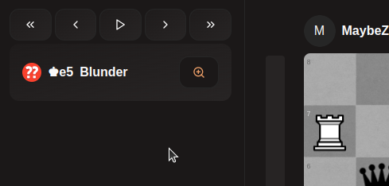

# Controls & Hotkeys

Conrols allows you to navigate accross the game easily, there are 5 controls that allows you to:
- Skip to the beginning of the game
- Go back one move
- Go to the next move
- Skip to the end of the game
- Toggle autoplay

Hotkeys
For each of those controls a hotkey is assigned:
| Control | Hotkey |
| --- | --- |
| Skip to the beginning of the game | CTRL + Left Arrow |
| Go back one move | Left Arrow |
| Go to the next move | Right Arrow |
| Skip to the end of the game | CTRL + Right Arrow |
| Toggle autoplay | Space |

There are also additional keybinds

| Control | Hotkey |
| --- | --- |
| Flip board | F |