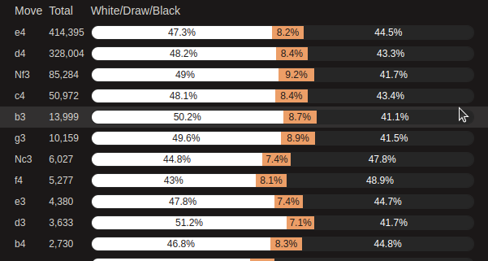

# Database
Castled has a large database of games played at +2400 ELO on Lichess. When opening the Database tab, you can visualize the statistics of every move at the current position if it appears in the database.

The Total represents the amount of time this move has been played in our database. The white parts represent the amount of chess games that endded by a win for White after playing that move in the current position. The orange is the amount of drawn games and the black is the amount of games won by Black.
When hovering over a move, an arrow will apprear on the chessboard allowing you to visualize it. 