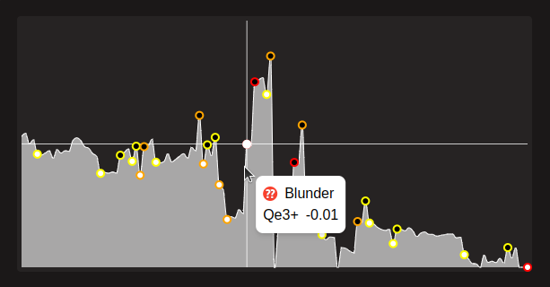

# Evaluation & Evaluation History
The evaluation bar indicates the engine evaluation for the current position, if the evaluation score is positive (more than ½ of the eval bar is filled with white), white has an advantage in the position. otherwise, black is winning. You also have access to a graph displaying the evolution of the engine evaluation during the game. Here, bad moves are displayed so you can understand their impact on the game. Clicking at any point in the graph will jump to the position.

