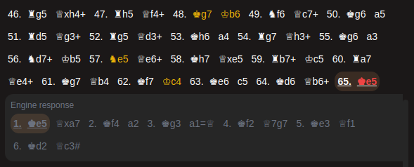

#Move list
The move list allows you to easily navigate in the moves played during the game. If you asked for move classification, the bad moves will be highlighted by a color representing their classification. When a bad move is selected, clicking the icon in the controls allows you to understand why that move is bad. It will display the engine response, essentially what the engine would recommend doing in response to this bad move.

