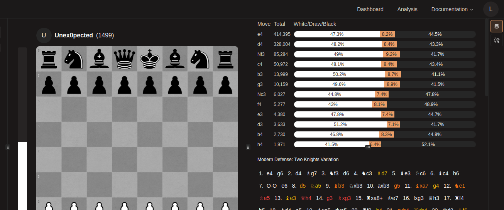
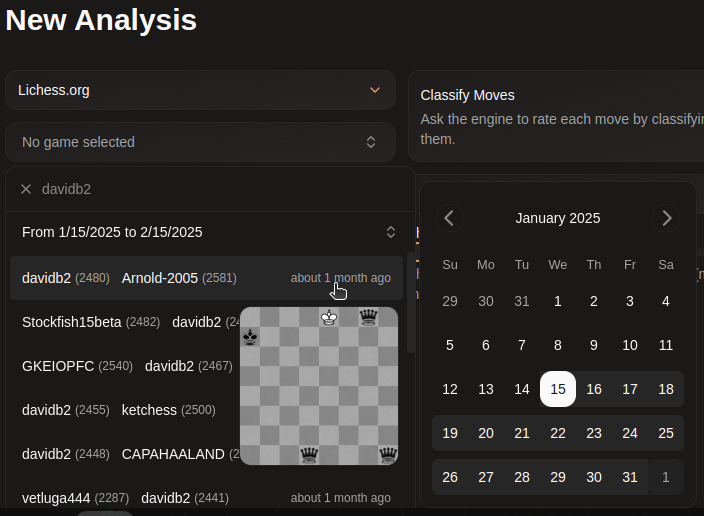
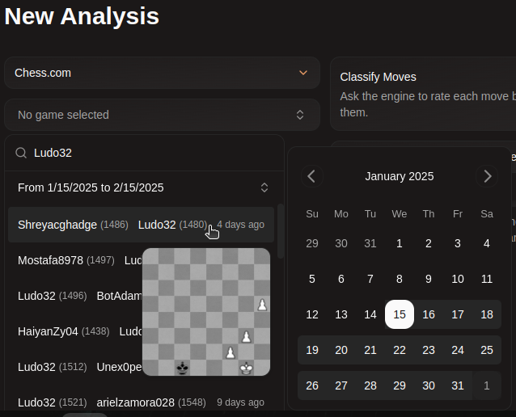
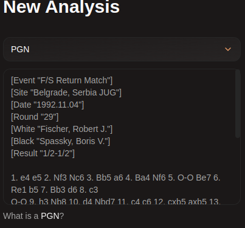

# Quickstart

## Importing chess games
Castled allows you to import chess games using 3 different methods:

- [Importing_from_Lichess.org](#importing-from-lichess)
- [Importing from Chess.com](#importing-from-chesscom)
- [mporting from a PGN](#importing-from-a-pgn)

## Importing from Lichess
To import a chess game directly from lichess, navigate to the Analysis tab and select Lichess.org as an import method. A new drop-down should appear allowing you to search for a specific lichess account. Selecing an account will display a list of games played by that account in the selected time span (last few days by default). You can also search for a game that happened at a slecific time using the calendar that pops up when clicking the time span.

## Importing From Chess.com
To import a chess game directly from chess.com, navigate to the Analysis tab and select Chess.com as an import method. A new drop-down should appear allowing you to search for a specific chess.com account. Selecing an account will display a list of games played by that account in the selected time span (last few days by default). You can also search for a game that happened at a slecific time using the calendar that pops up when clicking the time span.

## Importing from a PGN
If the game you're trying to analyze wasnt played on Lichess or Chess.com, you still have the option to import it by pasting the PGN in the form.

## Analysis Settings
When requesting an analysis, a few settings are available. First, you can chose if the engine should classify the moves more on that feature here. You can also chose which engine should make the analysis.

## Selecting an Engine
When importing a game, you have the choice of which engine should analyze your game, there are currently 4:
- Stockfish 16.1 Large Multithreaded — Heavy to download but more powerful, it can utilize multiple of your computer's CPUs and analyze faster.
- Stockfish 16.1 Large Singlethreaded — Heavy to download but works on a lot more devices than multithreaded engines.
- Stockfish 16.1 Small Multithreaded — Light to download. it can utilize multiple of your computer's CPUs and analyze faster.
- Stockfish 16.1 Small Singlethreaded — Light to download and works on a lot more devices than multithreaded engines.