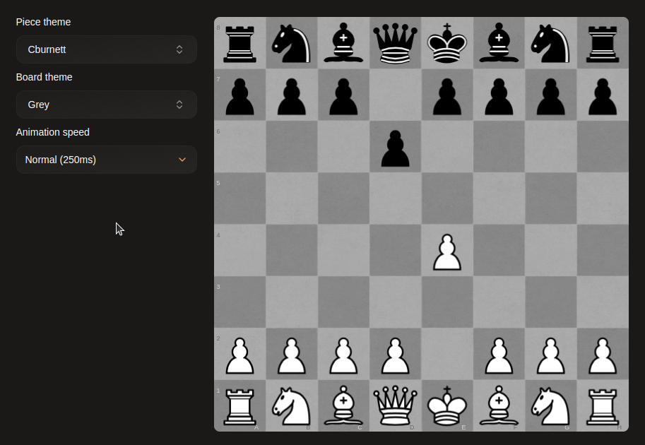

# Theming

Caslted allows you to customize how the chessboard looks and behaves, Click on your account icon in the navigation menu, then click Theme.
In here, you can change a few things
- The chessboard style
- The pieces style
- The move animation speed

